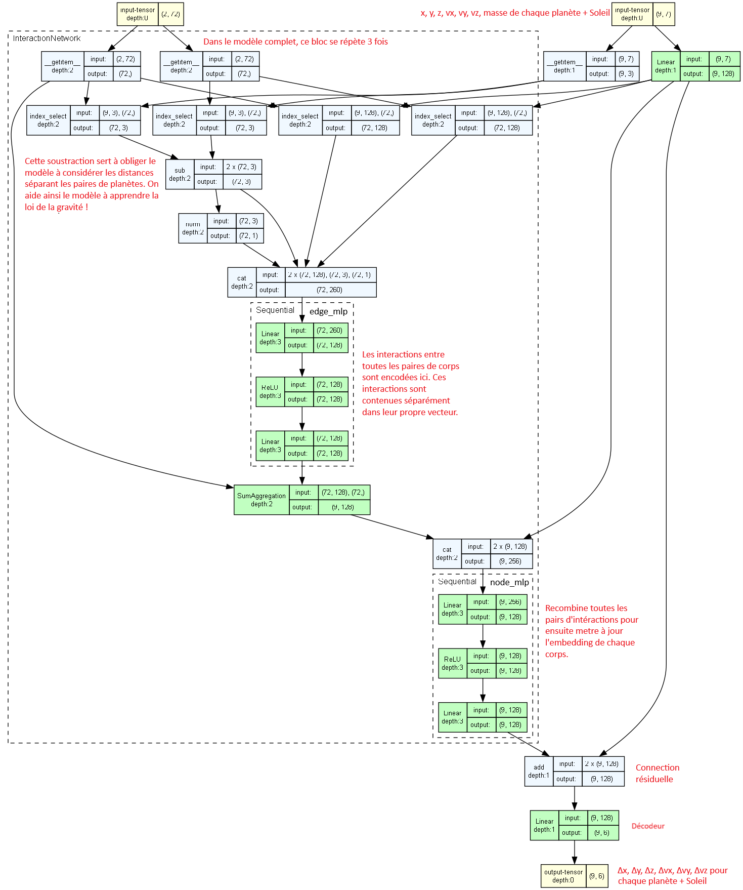
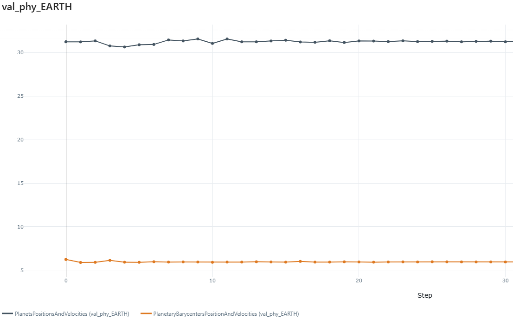

# Solar System Dynamics Prediction (GIF-7005 Project)

## Project Overview

This project focuses on predicting the coordinates and velocities of solar system bodies using deep learning techniques. It compares the performance of Graph Neural Networks (GNNs) and Long Short-Term Memory (LSTM) networks under different configurations, specifically investigating the impact of incorporating physical laws into the training process (Physics-Informed Machine Learning).

The core objective is to evaluate whether adding a physics-informed loss term—derived from Newton's Law of Universal Gravitation—improves the accuracy and generalizability of the models compared to purely data-driven "vanilla" approaches.

### Dataset Source & Accuracy
The dataset for this project is sourced via **`astroquery.jplhorizons`**, which interfaces with the **NASA/JPL Horizons On-Line Ephemeris System**. This system provides highly accurate orbital data based on the **Development Ephemerides (DE440/DE441)** produced by the Jet Propulsion Laboratory.
*   **DE440 (Modern Era)**: Optimized for the period 1550–2650, offering sub-meter accuracy for inner planets and kilometer-level accuracy for outer planets, integrated from spacecraft range data (e.g., Juno, Cassini).
*   **Ground Truth**: These ephemerides serve as the international standard for solar system dynamics, making them an ideal "ground truth" for training and validating our machine learning models.

## Key Features

*   **Model Comparison**: Comprehensive evaluation of multiple model architectures:
    *   **GNN (Graph Neural Network)**: Trained on the positions and velocities of both planetery system barycenter and planetary  datasets.
    *   **LSTM (Long Short-Term Memory)**: Trained on Planetary datasets.
*   **Physics-Informed Loss**: implementation of a custom loss function (`PhysicsInformedLoss.py`) that penalizes deviations from Newtonian mechanics, ensuring physically consistent predictions.
*   **Dataset Analysis**: Comparison of results using different reference frames (planetery system barycenter vs. Planetary).
*   **Prediction**: Generation of future trajectories for solar system bodies (e.g., for the year 2025).

## Project Structure

*   **`ModelComparizons.ipynb`**: The main notebook for analyzing and comparing the results of different models. It loads predictions, computes metrics, and visualizes trajectories.
*   **`PhysicsInformedLoss.py`**: A PyTorch module implementing the physics-informed loss function. It calculates the theoretical acceleration based on Newton's laws and compares it with the model's implied acceleration.
*   **`Predict2025.ipynb`**: Notebook dedicated to generating predictions for the year 2025.
*   **`GNNTest.ipynb`**: Development and testing notebook for the GNN architecture.
*   **`GetPlanetsPositionsTest.ipynb`**: Utility for testing data extraction and planetary position calculations.
*   **`data/`**: Directory containing the input datasets (coordinates and velocities of celestial bodies).
*   **`results/`**: Directory storing the output predictions from the trained models.
*   **`model/`**: Directory containing the model architectures.
*   **`GNN_trainer.py`**: Training script for the GNN architecture, logs everything in MLflow.

## GNN Architecture

The model architecture follows the **Interaction Network** paradigm, which aligns closely with the intuition of calculating pairwise forces and aggregating them.

1.  **Graph Construction**:
    *   The solar system is represented as a fully connected graph where **Nodes** are celestial bodies (Sun, planets) and **Edges** represent their interactions (gravity).
    *   **Node Features**: Position ($x, y, z$), Velocity ($v_x, v_y, v_z$), and Mass ($m$).

2.  **Message Passing Mechanism**:
    *   **Edge Model (Interaction)**: For every pair of bodies, a neural network (MLP) takes the features of the two bodies and their relative distance as input and computes a comprehensive **Edge Embedding** (interactions).
    *   **Aggregation**: For each body, the model sums up all incoming edge embeddings. This is analogous to summing the interaction force vectors from all other planets impacting this specific body.
    *   **Node Model (Update)**: A second MLP takes the body's current state and the summed interaction effects to compute a new latent representation of the body's future state.

3.  **Deep & Residual Structure**:
    *   **Encoder**: Projects raw physical data (7 inputs) into a 128-dimensional latent space.
    *   **Processor**: 3 stacked Interaction Network layers with **residual connections** refine these embeddings. This allows the model to learn complex, non-linear dependencies over multiple "steps" of reasoning.
    *   **Decoder**: Projects the final latent state back to physical outputs (predicted change in position and velocity).

  

## Interesting Results

*   **Loss physics-informed negative impact on planets close to the sun**: We suspect the Loss physics-informed is introducing noise in the predictions of the planets close to the sun due to the relativistic effects happening when big masses are close to each other.

*   **Loss physics-informed negative impact on planets low planet moon mass ratios**: Our dataset does not explicitly contain state information for moons. However, the planetary trajectories used for training are physically gravitationally perturbed by these satellites. This discrepancy creates noise in the physics-informed loss function, particularly for systems with high satellite-to-planet mass ratios. The graph below demonstrates this impact on Earth predictions by comparing the physics-informed loss when using the Earth-Moon Barycenter as the reference frame versus the Earth's geometric center and the combined Earth-Moon mass. This comparison is critical for the Earth-Moon system, as the Moon represents approximately 1% of Earth's mass—a ratio large enough to cause significant trajectory wobbles that confuse the model.

  

*(This section is reserved for manual insertion of pertinent result images and charts.)*

 
 
 
